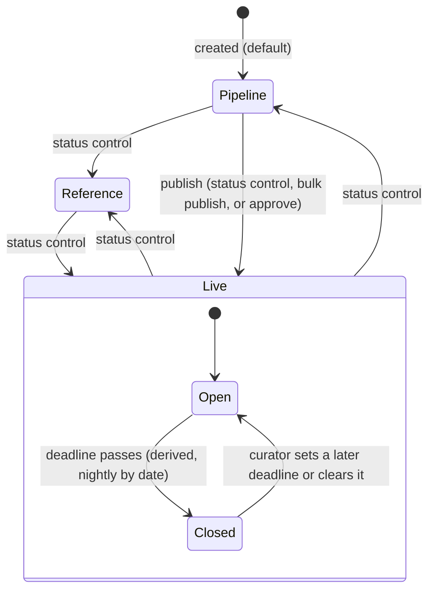

# AskHub — Product Requirements Document

| | |
|---|---|
| **Product** | AskHub, the public resource directory of the AI Hub for Sustainable Development |
| **Document** | Product Requirements Document (PRD) |
| **Version** | 2.0 |
| **Date** | 20 September 2026 |
| **Document owner** | AI Hub programme team (product owner role) |
| **Status** | Final for circulation |
| **Audience** | Programme leadership, partner and donor organisations, engineering, future maintainers |

## Revision history

| Version | Date | Change |
|---|---|---|
| 1.0 | 25 July 2026 | Internal implementation specification, written for the build team. Archived at `docs/archive/askhub-prd-v1-internal.md`. |
| 2.0 | 20 September 2026 | Rewritten for external circulation against the delivered system. Describes the current release as built; places intent not yet built into phased requirements; adds success metrics, governance, operations and an assumptions appendix. Supersedes 1.0. |

## Table of contents

1. [Executive summary](#1-executive-summary)
2. [Background and problem statement](#2-background-and-problem-statement)
3. [Vision, mission and product principles](#3-vision-mission-and-product-principles)
4. [Goals, objectives and success metrics](#4-goals-objectives-and-success-metrics)
5. [Target users and personas](#5-target-users-and-personas)
6. [Scope](#6-scope)
7. [User journeys and key flows](#7-user-journeys-and-key-flows)
8. [Functional requirements](#8-functional-requirements)
9. [Content model and governance](#9-content-model-and-governance)
10. [Non-functional requirements](#10-non-functional-requirements)
11. [Information architecture and UX principles](#11-information-architecture-and-ux-principles)
12. [Analytics and measurement plan](#12-analytics-and-measurement-plan)
13. [Dependencies, constraints and risks](#13-dependencies-constraints-and-risks)
14. [Release plan and phasing](#14-release-plan-and-phasing)
15. [Operations and sustainability](#15-operations-and-sustainability)
16. [Governance and approvals](#16-governance-and-approvals)
17. [Open questions and decisions log](#17-open-questions-and-decisions-log)
18. [Glossary](#18-glossary)
19. [Appendix: assumptions to confirm](#19-appendix-assumptions-to-confirm)

---

## 1. Executive summary

AskHub is a public, curated directory of opportunities that African AI and data innovators can actually access. It is built and operated by the AI Hub for Sustainable Development, an initiative co-led by the Italian Ministry of Enterprises and Made in Italy (MIMIT) and the United Nations Development Programme (UNDP). Anyone can browse it; no account is needed.

The directory lists resources in seven categories — Courses, Accelerators, Funding, Compute, Data & Datasets, Challenges & Competitions, and Community & Events — each tagged by the sectors, stages and countries it is open to. Every listing is reviewed by the AI Hub programme team before it is published. The directory states this once, globally: *every resource is curated by the AI Hub team*. It never claims that an individual resource has been "verified".

The current release delivers: the public directory with search, filtering, sorting, a resource detail page and CSV/Excel export; a public "Suggest a resource" form that feeds a review queue; and an administration portal for the programme team to create, import, review, publish and close resources, with a complete audit trail of who changed what. Resources whose deadline has passed leave the public listings automatically but keep their own page so that shared links continue to resolve.

Deliberately out of scope for this release: visitor accounts and profiles, profile-to-resource matching, email alerts and subscriptions, provider logos on the public site, and any collection of personal data beyond the name and email a person volunteers when suggesting a resource. Reach and engagement reporting is specified but not yet live; the portal says so rather than showing a number it cannot source.

## 2. Background and problem statement

Opportunities for African AI innovators exist in abundance — cloud credits from technology companies, research grants, accelerator cohorts, open datasets, competitions, training programmes — but they are scattered across dozens of provider websites, mailing lists, and personal networks. A founder in Kigali and a researcher in Dakar each discover a different, incomplete subset. Deadlines pass unnoticed. Eligibility is buried in fine print. Programmes that are genuinely open to African applicants are indistinguishable, at a glance, from those that are not.

The AI Hub for Sustainable Development sits at the centre of a network of such providers and already fields the question "what is out there for me?" through its programmes and partners. A directory is the lowest-friction way to answer it at scale: one place, no login, every entry reviewed by a team that knows the landscape, with the two questions that matter most — *is this really an AI or data resource, and can an African innovator actually access it?* — answered before an entry is published.

The problem AskHub solves is therefore not the absence of opportunities but their fragmentation, and the cost of that fragmentation falls on the people with the least time to absorb it.

## 3. Vision, mission and product principles

**Vision.** Every African AI innovator can find, in minutes, the opportunities they are eligible for.

**Mission.** Maintain a curated, current, open directory of AI and data resources accessible to innovators in any African country, operated by the AI Hub programme team on a regular cycle.

**Product principles**

| Principle | What it means in practice |
|---|---|
| Low friction | No account, no login, no paywall. The directory is readable without JavaScript and renders its full content in the initial page. |
| Curated, not verified | Every entry is reviewed before publication. The directory states this once, globally, and never labels individual entries as verified — a claim the team cannot underwrite for a third party's programme. |
| Accessible | WCAG 2.1 AA is the standard. Where the visual design and accessibility conflict, accessibility wins (two brand colours were darkened for exactly this reason). |
| Open to any African country | Country and sector are tags that help a visitor narrow the list. They are never a barrier to seeing an entry. The directory carries no catch-all "global programmes" country option that would hide entries from anyone. |
| Honest by construction | The system never fabricates a figure. A reporting panel with no data says so in words. A seeded number without a source and an attester cannot be stored. |
| Attribution | The AI Hub is always "co-led by MIMIT and UNDP", never "powered by" or "implemented by" either. |

## 4. Goals, objectives and success metrics

### 4.1 Goals

1. **Coverage** — the directory lists the opportunities that matter to African AI innovators, across all seven categories, and keeps them current.
2. **Reach** — innovators find the directory and use it to reach providers.
3. **Trust** — every listing is accurate on the day it is read; closed opportunities never present as open.
4. **Sustainability** — the programme team can run the directory on a fortnightly cycle without engineering involvement.

### 4.2 Success metrics

Metrics fall into two groups: those the system counts today, and those that require engagement capture, which is specified (§12) but not yet live. Targets marked *proposed* have not been agreed by the programme team and are offered as starting points.

| # | Metric | Source today | Target | Status |
|---|---|---|---|---|
| M1 | Live resources in the directory | Admin dashboard "Resources live" tile | Proposed: ≥ 60 at three months after launch; ≥ 120 at twelve | Countable now |
| M2 | Resources added per fortnightly cycle | Audit log (`created` entries) | 10–20 per cycle (product intent) | Countable now |
| M3 | Category coverage | Dashboard "Live resources by need" panel | Proposed: no category with fewer than 5 live entries | Countable now |
| M4 | Country coverage | Dashboard "Coverage" tile | Proposed: all 18 programme countries reachable by at least one live entry | Countable now |
| M5 | Public suggestions received and time to first review | Review Queue; audit log timestamps | Proposed: every suggestion reviewed within one cycle (14 days) | Countable now |
| M6 | Listings past their deadline still showing as open | Not possible by construction (§8, FR-060) | 0 | Guaranteed |
| M7 | Directory visits, resource views, apply-clicks, searches, exports | Requires GA4 and first-party event capture | To be set once three months of data exist | Not yet measurable |
| M8 | Apply-click rate (apply-clicks ÷ resource views) | As M7 | To be set with M7 | Not yet measurable |

## 5. Target users and personas

Personas are roles, not individuals.

### 5.1 Primary: African AI and data innovators

| Persona | Situation | Jobs to be done | Needs from AskHub |
|---|---|---|---|
| The early-stage founder | Building a first AI product in an African country; small team; limited runway | Find compute credits and non-dilutive funding; find an accelerator that admits companies at their stage | Filter by category, stage and country in one screen; see the deadline before opening the entry; a link that goes straight to the application |
| The researcher or graduate student | At a university or lab; needs data, compute and training more than capital | Find open datasets and benchmarks; find courses and grants for research | Category browse; a plain description that says who it is for; export the list to work through offline |
| The ecosystem builder | Runs a hub, chapter or programme; advises many innovators | Keep a current view of what is open, and share it | Search that understands plain language; a shareable link per resource; a downloadable list |

### 5.2 Secondary: partners, donors and the programme team

| Persona | Jobs to be done | Needs from AskHub |
|---|---|---|
| Partner or donor organisation | See that their opportunity is listed accurately; understand the directory's reach | A stable public page per resource; the reach reporting of §12 when it is live |
| The content curator (programme team) | Add, import and keep listings current on a fortnightly cycle; review public suggestions | An admin portal that needs no engineer; bulk import from the team's tracking spreadsheet; a queue of suggestions with one-click approval |
| The site administrator (programme team) | Manage who can edit; configure analytics; keep the home-page copy current | Team access management; settings that apply without a redeploy |
| Programme leadership (read-only) | See coverage and, later, reach | A dashboard that shows true counts and says plainly what it cannot yet show |

## 6. Scope

### 6.1 In scope (current release)

- Public directory: home page with browse-by-category menu, recently added rail and the full directory; search with plain-language parsing; filters by category, sector, stage and country; two sort orders; pagination; CSV and Excel export of the filtered list.
- Resource detail page with eligibility panel, deadline status, apply link, share options and structured data for search engines.
- Public "Suggest a resource" form, rate-limited, feeding the review queue.
- Contact page with the single AI Hub mailbox.
- Administration portal: dashboard; resources table with tabs, filters, bulk publish, row delete, and a create/edit form in a modal; tracker import from CSV or Excel; review queue; settings (analytics identifier, team access, contact mailbox, home-page welcome copy); audit log; sign-in, invitation and password reset.
- Automatic closing of resources whose deadline has passed.
- Placeholder legal pages (privacy, terms) whose copy is editable in the database.

### 6.2 Out of scope (current release)

| Item | Rationale |
|---|---|
| Visitor accounts and innovator profiles | Adds personal data and account support burden before the directory has proven its value. A feature flag exists so the capability can be introduced without a schema change. |
| Profile-to-resource matching | Depends on profiles. |
| Email alerts, subscriptions and digests | Requires a transactional email provider (not yet chosen), consent records and unsubscribe handling. The data tables exist and are empty. |
| Personal data collection beyond the suggestion form | Principle, not omission. See §10.5. |
| Provider logos on the public site | The team confirmed that AskHub has no official partners; providers are organisations whose opportunities are listed. A logo row implied a relationship that does not exist, and most providers have supplied no logo. The registry still holds a logo field for a future surface. |
| Public impact-stories page | Built behind a feature flag that is off; content is unattested. |
| Partnerships pipeline, updates log screen, reach reporting screens | Specified in the archived internal specification; deferred (§14). |
| Multilingual content | English at launch. The copy layer and the database support French, Portuguese and Arabic; the translations do not exist. |

### 6.3 Explicitly deferred with rationale

| Item | Phase | Why it waits |
|---|---|---|
| Closed resources listed with an expected reopening date | Phase 2 | Requires a new field, a change to listing behaviour, and a curation rule for setting the date. Today a closed resource keeps its own page but leaves the listings. |
| Sourcing-channel and Mattei Plan reporting fields on each resource | Phase 2 | The four sourcing channels are an operating process today (§9.5); recording the channel per resource needs a field and a form control. |
| Engagement capture and reach reporting | Phase 2 | Event capture must be correct from its first minute; it ships with the security work (captcha, rate limiting, content-security headers) that public write traffic needs. |

## 7. User journeys and key flows

### 7.1 Visitor: discover

1. Arrives at the home page (from a link, a search engine once indexing is enabled, or the AI Hub site).
2. Reads the welcome band and, if present, the headline reach strip.
3. Either scans the **Browse** menu on the left (seven categories, each with its live count, expandable to sub-categories) or the **Recently added** rail.
4. Scrolls to **All resources**, or types into the search pill in the header.

### 7.2 Visitor: filter and search

1. Types a plain-language query such as "funding for health AI in Kenya".
2. The directory turns recognisable words into filters (Funding; Health; Kenya) and searches the remaining words across name, provider, description and sub-category.
3. Refines with the four dropdowns (Categories, Sectors, Stages, Countries) and the sort control (Featured Resources, Recently added).
4. Active filters appear as removable chips. The URL carries every filter, so the view can be bookmarked or shared.
5. Pages through results, twelve per page.

### 7.3 Visitor: open a resource

1. Opens a card. The detail page shows the provider, the description, a "Who can apply" panel (stages, sectors, countries, deadline), and the deadline status.
2. If the resource is open, an apply button leads to the provider's own site in a new tab. If it is closed, the apply button is absent and a Closed marker is shown.
3. Shares the page by link, LinkedIn, email or WhatsApp.

### 7.4 Visitor: submit a resource

```mermaid
sequenceDiagram
    participant V as Visitor
    participant F as Suggest form (browser)
    participant S as Server action
    participant DB as Database function
    participant Q as Review Queue (admin)
    V->>F: Opens "Suggest a resource" on /contact, fills 11 fields
    F->>F: Validates locally (required fields, https link, honeypot empty)
    F->>S: Submits
    S->>S: Validates again; hashes caller's network address with a secret
    S->>DB: submit_resource_suggestion(...)
    DB->>DB: Re-checks caps; rate limits (3/address/hour, 5/network/hour, 60/10 min)
    DB-->>S: Row inserted as pending, or error code
    S-->>F: One of: sent / rate-limited / invalid / failed
    F-->>V: "Submitted — the AI Hub team will review it before it goes live"
    Q-->>Q: Suggestion appears, oldest first
```

The visitor is told the same thing whether the suggestion was stored or refused as a duplicate of recent activity; the form never reveals what the queue contains.

### 7.5 Administrator: review a suggestion

1. Opens **Review Queue**. Each card shows the type (New resource or Update), title, description, organisation, category, link, the submitter's name and email, and an optional programme contact.
2. For a new resource: **Approve & publish** (creates the resource live, creating the provider if unknown, and marks the suggestion approved), **Edit first** (opens the resource form pre-filled; saving approves), or **Reject**.
3. For an update suggestion: **Open resource to edit** (opens the target resource with the suggestion beside it; saving approves) or **Reject**.
4. The card leaves the queue once its status is no longer pending. The audit log records `approved` or `rejected` against the submission and, where applicable, `created` against the provider and the resource.

### 7.6 Administrator: publish, expire, reopen



- **Publish**: set status to Live from the row control, the edit form, or by ticking rows and using **Publish selected (n)**.
- **Expire**: nothing to do. When a resource's deadline date passes, it leaves the public listings and its page shows Closed. Its status remains Live; the admin table shows it under the **Closed** tab flagged "Auto-closed, past deadline". Resources within 14 days of their deadline appear under **Expiring soon**.
- **Reopen**: edit the resource and set a new deadline (or clear it for a rolling opportunity). It returns to the listings immediately.
- **Withdraw**: set status to Pipeline or Reference; the resource leaves the public site but is kept.
- **Delete**: from the row, with a confirmation. Refused while a public suggestion still refers to the resource.

## 8. Functional requirements

Each requirement is numbered, testable, and true of the current release. Requirements not yet met are in §14, not here.

### 8.1 Public directory

| ID | Requirement |
|---|---|
| FR-001 | The home page shall render, without JavaScript, the welcome band, the browse-by-category menu, the recently added rail and the full directory of live, open resources. |
| FR-002 | The browse menu shall list all seven categories in a fixed order, each with its count of live, open resources, including categories whose count is zero. |
| FR-003 | Expanding a category in the browse menu shall show up to four of its sub-categories and a "More" link to the category's full list. |
| FR-004 | The recently added rail shall show the six most recently added live, open resources. |
| FR-005 | Each directory card shall show the provider, the title, the primary category, any secondary category, sector and geographic tags, the deadline status, a description clamped to three lines, a View details link to the detail page and (when open) an apply link to the provider's application page. |
| FR-006 | Featured resources shall sort first under the default sort; ties shall break by curator sort order, then by identifier, so the order is stable between renders. |
| FR-007 | The directory shall paginate at twelve resources per page; a page number beyond the last shall show the first page. |
| FR-008 | A visitor shall be able to download the currently filtered list as CSV or Excel, containing only the public fields (name, provider, type, categories, sub-category, description, link, countries, sectors, stages, geographic scope, deadline, date added). |
| FR-009 | Any resource that has left the public listings (deadline passed, or status not Live) shall not appear in the directory, the browse counts, the rail, search results or the export. |
| FR-010 | No page on the public site shall link to, or mention, the administration portal. |

### 8.2 Search and filtering

| ID | Requirement |
|---|---|
| FR-020 | The header search and the directory search shall accept free text and turn recognised category, sector, stage and country words into the corresponding filters, searching the remaining words. |
| FR-021 | A free-text query shall match a resource when every remaining word appears somewhere in its name, provider, description or sub-category. |
| FR-022 | Filters shall be selectable by category, sector, stage and country; an empty sector or country list on a resource shall mean "open to all" and match every selection. |
| FR-023 | A resource whose geographic scope is Global, All Africa or AI Hub programme countries shall match every country selection; only a resource scoped to Selected countries shall be narrowed by its country list. |
| FR-024 | The country filter shall offer exactly the 18 programme countries and no catch-all option. |
| FR-025 | Every active filter, the query, the sort and the page shall be represented in the URL, so a filtered view is shareable; unrecognised URL values shall fall back to defaults rather than producing an empty result. |
| FR-026 | Changing any filter shall return the visitor to page one; changing only the page shall not reset filters. |
| FR-027 | Two sort orders shall be offered: Featured Resources (default) and Recently added. |

### 8.3 Resource detail

| ID | Requirement |
|---|---|
| FR-040 | Every resource with status Live shall have a public page at a stable address, including after its deadline has passed. |
| FR-041 | The detail page shall show the provider (linked to its website when one is recorded), title, description, the "Who can apply" panel (stages, sectors, countries or scope, deadline), and the deadline status in one of: Rolling, N days left, Closes today, Closed. |
| FR-042 | The apply link shall be shown only while the resource is open; a closed resource shall show a Closed marker instead. |
| FR-043 | The page shall offer sharing by copied link, LinkedIn, email and WhatsApp, with editable pre-written text. |
| FR-044 | The page shall embed schema.org Offer structured data derived from the resource, omitting any property whose value is absent. |
| FR-045 | The page shall carry the global curation statement: "Every resource is curated by the AI Hub team." No per-resource verification claim shall appear anywhere on the site. |
| FR-046 | A resource that is not Live, or does not exist, shall return a not-found response. |

### 8.4 Submission

| ID | Requirement |
|---|---|
| FR-060 | The Contact page shall offer a "Suggest a resource" form with: resource name, organisation name, category, sectors, countries (with "Open to all"), short description, link to apply, deadline, contact email (optional), the submitter's name and email. |
| FR-061 | The form shall require name, organisation, category, description, an https link, and the submitter's name and email; the description shall be capped at 1,500 characters. |
| FR-062 | The chosen countries, sectors and deadline shall be appended to the description as one line for the reviewer; the submitter's name, email and the programme contact shall be stored in their own fields and never copied into any public text. |
| FR-063 | A hidden field shall be present that no person fills; a non-empty value shall cause the submission to be refused as invalid. |
| FR-064 | Submissions shall be rate-limited at the database: 3 per submitter address per hour, 5 per network address per hour (when a keyed hash is configured), 60 in total per 10 minutes; a rate-limited submission shall be reported to the visitor as such. |
| FR-065 | A submission shall be stored as pending, of type "new resource", and shall not be able to set its own status, reviewer or target resource. |
| FR-066 | On success the form shall be replaced by a confirmation and offer no second attempt. |

### 8.5 Administration and curation

| ID | Requirement |
|---|---|
| FR-080 | The portal shall be reachable only by an invited account; there shall be no self-registration, enforced at the identity provider. |
| FR-081 | Three roles shall exist: admin, editor, viewer. A viewer shall have no write capability on any table and shall see no write control, not even a disabled one. |
| FR-082 | Every write shall re-check the caller's role on the server before acting; interface gating shall not be relied on. |
| FR-083 | An admin shall be able to invite a colleague by email, change a colleague's role, and deactivate or reactivate an account, but never change their own role or deactivate themselves. |
| FR-084 | An operator who has forgotten their password shall be able to request a reset link by email; the request shall respond identically whether or not the address has an account. |
| FR-085 | The dashboard shall show only figures counted from the database at request time: resources live (with pipeline count), pending review, expiring within 14 days, coverage (countries and sectors reached), and live resources by category. It shall show no reach figure until engagement capture exists, and shall say so. |
| FR-086 | The resources table shall offer tabs All, Expiring soon and Closed (each with its count), search by name or provider, and filters by status ("All statuses") and category ("All categories"). |
| FR-087 | The resources table shall offer, to admin and editor only: an inline status control, a featured toggle, a checkbox per row with **Publish selected (n)**, an Edit action, and a Delete action with confirmation. |
| FR-088 | Add resource and Edit shall open the same form in a modal, with fields: resource title, provider, provider tier, resource type, status, category, secondary category, sub-category, stages, sectors, countries (scope and list), one-sentence summary, action label, deadline, banner image URL, application link, featured, exclusivity, sort order. |
| FR-089 | The provider field shall be free text with every known provider offered as a suggestion; a name not in the registry shall be created as a provider when the resource is saved, and the form shall say so beside the field. |
| FR-090 | The form shall refuse a save with no eligible stage, or with "Selected countries" scope and no country chosen. |
| FR-091 | Tracker import shall accept a CSV or Excel export of the team's tracking sheet, up to 512 KB and 500 rows, preview every row's outcome before import, create up to 50 new providers per file, insert rows one at a time so one failure does not roll back the rest, and report per-row results. |
| FR-092 | The Review Queue shall list pending suggestions oldest first and offer the actions of §7.5. |
| FR-093 | Settings shall offer exactly four cards: Analytics (GA4 Measurement ID), Team access, Contact email (fixed to the one AI Hub mailbox), and Welcome band (home-page title and body). Each field shall save when the operator leaves it. |
| FR-094 | Every insert, update and delete on a curated table shall produce one audit entry, written inside the same database transaction as the change, attributed to the signed-in account, with sensitive values redacted. A change whose audit entry cannot be written shall not be committed. |
| FR-095 | The audit log shall be append-only for every role and shall be filterable by action, actor and date range, fifty entries per page. |
| FR-096 | Edits to home-page copy, settings and resources shall appear on the public site without a rebuild or redeploy. |

### 8.6 Content lifecycle

| ID | Requirement |
|---|---|
| FR-110 | A resource shall have exactly one status: Live, Pipeline or Reference. Only Live resources are public. |
| FR-111 | A resource's deadline shall be optional; absent means rolling. |
| FR-112 | A Live resource whose deadline date is earlier than the current date shall be treated as closed: absent from public listings, its page marked Closed, listed under the admin Closed tab. The status value shall not change. A resource whose deadline is today shall be open. |
| FR-113 | A Live resource whose deadline is within the next 14 days shall be listed under Expiring soon and its card shall show the days remaining. |
| FR-114 | Setting a later deadline, or clearing it, on a closed resource shall reopen it immediately. |
| FR-115 | Deleting a resource shall be refused while a public suggestion refers to it. |

### 8.7 Categories and tags

| ID | Requirement |
|---|---|
| FR-130 | Exactly seven categories shall exist, defined in one place in the database and mirrored in the application: Compute, Courses, Accelerators, Funding, Data & Datasets, Challenges & Competitions, Community & Events. |
| FR-131 | Each resource shall have one primary category and at most one secondary category, and shall be counted once under each. |
| FR-132 | Sectors shall be drawn from six values; stages from four; countries from the 18 programme countries; geographic scope from four values (Global, All Africa, AI Hub programme countries, Selected countries). |
| FR-133 | Sector, stage and country lists on a resource shall be tags for filtering and display; they shall never prevent a visitor from seeing a resource unless the visitor has chosen a filter that excludes it. |
| FR-134 | "Democratic Republic of the Congo" shall always be written in full. |

## 9. Content model and governance

### 9.1 The seven categories

| Category | What belongs in it |
|---|---|
| Compute | Processing power and cloud credits to train and run models. |
| Courses | Courses and curricula to learn and build a skill. |
| Funding | Money to finance the work — grants, prizes and investment. |
| Accelerators | Structured, time-bound programmes that support a venture's growth. |
| Data & Datasets | Open datasets and benchmarks for building and evaluating AI. |
| Challenges & Competitions | Competitions and hackathons to test skills on real problems. |
| Community & Events | Gatherings, chapters and events that connect the African AI community. |

### 9.2 Eligibility gates

There are two, and only two, and they are applied by the reviewer before publication:

1. The resource is a genuine AI or data resource.
2. An African innovator must be able to access it.

A resource that fails either is not listed. Nothing else is a gate.

### 9.3 Tags

| Tag | Values | Role |
|---|---|---|
| Sectors | Energy, Agriculture, Health, Water, Education & Training, Infrastructure | Filter and display. Empty means open to all sectors. |
| Stages | New to AI, Getting started, Building, Scaling | Filter and display. |
| Geographic scope | Global, All Africa, AI Hub programme countries, Selected countries | Display, and the rule for whether the country filter applies. |
| Countries | The 18 programme countries: Algeria, Angola, Côte d'Ivoire, Democratic Republic of the Congo, Egypt, Ethiopia, Gabon, Ghana, Kenya, Mauritania, Morocco, Mozambique, Republic of the Congo, Rwanda, Senegal, Tanzania, Tunisia, Zambia | Filter and display, used only under Selected countries. |
| Resource type | Programme, Credits, Course, Community, Dataset, Competition, Fund, Report (free text; other values allowed) | Display on the admin table and public card. |
| Provider tier | Strategic, Government, Development partner, Academic, Network | Internal classification of the provider organisation; not shown publicly. |
| Featured; Exclusivity | Featured; Exclusive to the AI Hub / Early access | Public badges; Featured affects default sort. |

A Mattei Plan reporting flag is not a field in the current release (§19, A2).

### 9.4 Provider registry

Every resource names a provider — the organisation whose opportunity it is. Providers are held in a registry with name, optional website and optional logo. A provider is created automatically the first time a resource names it, from the resource form, the tracker import or an approved suggestion. AskHub has no official partners; the registry is a list of organisations whose opportunities are listed, not of relationships.

### 9.5 Sourcing channels

Resources enter through four channels. The first three enter the system through the admin resource form or the tracker import; the fourth through the public form.

| Channel | Who | Entry path |
|---|---|---|
| Team-sourced logging | Programme team, from its own knowledge and network | Admin form, or the team's tracking sheet via tracker import |
| Active scouting | Programme team, searching provider sites and announcements | Same |
| Partner referral | A provider or partner organisation tells the team | Same |
| Public submission | Anyone, via "Suggest a resource" | Review Queue |

The channel is not recorded on the resource in the current release (§19, A1).

### 9.6 Review and approval workflow

1. Every candidate resource, whichever its channel, is reviewed against the two gates and the quality standards below before it is set Live.
2. A public suggestion is reviewed from the Review Queue and either published (with or without editing first) or rejected. No reason is recorded for a rejection; the submitter is not notified.
3. Team-sourced and imported resources arrive as Pipeline and are published when reviewed. An import from a tracker sheet whose "gates passed" column is marked pre-approved arrives as Live, which the importer flags in its report.
4. Any admin or editor may publish. There is no separate approver role in the system (§19, A4).

### 9.7 Curation cadence

The programme team runs a fortnightly cycle with a target of 10–20 additions per cycle. Each cycle: sweep Expiring soon and Closed, review the queue, add new resources, run a quality pass, and sign off. The cycle is an operating practice; the system does not schedule it. The checklist is in the User Guide.

### 9.8 Quality standards

- Title: the opportunity's own name, as the provider writes it.
- Provider: the organisation's name, spelled consistently with existing entries (the form suggests them).
- Description: one to three sentences on what it offers and who it is for; no marketing superlatives; no claims the provider does not make.
- Link: the provider's own application or information page, https only.
- Deadline: the provider's date, or blank for rolling. Never an estimated date.
- Tags: only what the provider states. When in doubt, leave sectors empty (open to all) rather than guess.
- Nothing in the directory may contain a fabricated figure.

## 10. Non-functional requirements

### 10.1 Performance

- Public pages are statically rendered and served from the edge; the home page renders its full directory in the initial response.
- Public data is cached for up to 15 minutes and invalidated immediately on any admin write, so an edit appears without a rebuild.
- The Excel export library loads only when a visitor clicks export.

### 10.2 Accessibility

- WCAG 2.1 AA. Every text/background pairing in the category palette is held at or above 4.5:1 by an automated test that must not be relaxed.
- Skip link, labelled form fields, live regions for dynamic messages, keyboard-operable dialogs with Escape to close, reduced-motion respected.
- Automated coverage is currently contrast only; a manual keyboard and screen-reader pass is required before public launch (§19, A12).

### 10.3 SEO

- Every resource page carries a title, description and schema.org structured data.
- The current deployment is deliberately non-indexable (a gated preview). Indexing, a sitemap and `robots.txt` are enabled together at public launch.

### 10.4 Security

- Row-level security on every table, deny by default; anonymous readers see only public-safe views that exclude submitter details, internal notes and analytics counters.
- The service-role credential is server-only and used by exactly one code path (sending an invitation).
- Every mutating action re-checks the caller's role on the server; validation at every server boundary; no string-built SQL; no rendering of user-supplied HTML.
- SVG images are rejected everywhere; external links must be https.
- The audit log is append-only for every role.
- Public write traffic is rate-limited in the database. A captcha, content-security and strict-transport headers are planned for public launch (§14).

### 10.5 Privacy

- No visitor accounts, profiles, cookies for tracking, or marketing data.
- The one exception is the suggestion form: the submitter's name and email, and an optional programme contact address, are stored for review correspondence only, in fields marked sensitive that no public view can project and no approval copies into a resource. The visitor's network address is never stored; a keyed one-way hash of it is used only to rate-limit.
- Privacy and terms copy is editable in the database and is placeholder text pending legal review (§19, A11).

### 10.6 Localisation

English at launch. All copy lives in one locale file; French, Portuguese and Arabic stubs and per-resource description columns exist so translation is a content task, not a code change.

### 10.7 Browser and device support

Current versions of Chrome, Firefox, Safari and Edge on desktop and mobile. The layout collapses to one column below 900 px; the admin navigation collapses behind a menu button at that width.

### 10.8 Availability

Hosting is on managed platforms with no single server to maintain. No availability target has been set (§19, A7).

## 11. Information architecture and UX principles

| Page | Path | Components |
|---|---|---|
| Home | `/` | Welcome band, headline strip (hidden when empty), Browse-by-category menu, Recently added rail, All resources directory with search, filter chips, dropdowns, sort, grid, pagination, export |
| Resource detail | `/resources/{id}` | Hero band, badges, title, provider, description, apply and share actions, Who can apply panel, curation statement |
| Contact | `/contact` | Mailbox, Suggest a resource panel and modal form |
| Privacy, Terms | `/privacy`, `/terms` | Editable copy |
| About | `/about` | Redirects to the AI Hub website |
| Admin | `/admin/…` | Dashboard, Reach & Engagement (placeholder), Resources, Review Queue, Settings, Audit Log; sign-in, forgot password, set password |

UX principles: one search above the fold (the header pill), not two; the URL is the single source of filter state; every band hides itself rather than showing an empty frame; forms save on leaving a field where the prototype has no save button; a viewer sees no write control at all rather than a greyed one; visual values follow the approved prototype except where accessibility requires otherwise.

## 12. Analytics and measurement plan

**Principle.** Capture must be correct from the first minute the site is public; display may arrive later. A missing chart is recoverable; missing capture is not.

**Events (fixed names).** `resource_view`, `apply_click`, `search_performed`, `filter_used`, `export_clicked`. Each is to be sent to Google Analytics 4 and written to a first-party event table, so reporting does not depend on a third party's retention.

**State of implementation.** The GA4 Measurement ID can be entered in Settings and the first-party table exists with its access rules. No event is yet sent or written: the tag is not loaded and no code writes the table. The admin Reach & Engagement screen states this. Capture ships in Phase 2 alongside the public-launch security work.

**Reports planned once capture exists.** Visits and views over 7/30/90 days; top resources by views and apply-clicks; searches with no results (a curation signal); exports; coverage by country and sector (already live from the database).

**What is never shown.** Any figure the system did not count. The dashboard renders no card for a number it cannot source.

## 13. Dependencies, constraints and risks

| # | Item | Type | Mitigation |
|---|---|---|---|
| R1 | Supply of eligible resources: the target of 10–20 additions per cycle depends on the team's sourcing capacity | Risk | Tracker import removes per-row data entry; public suggestions add a channel; coverage metrics make gaps visible |
| R2 | Provider consent and accuracy: a provider may object to a listing or a listing may go stale | Risk | Every entry links to the provider's own page; deadlines auto-close; providers can suggest updates through the public form; the team can withdraw a resource in one click |
| R3 | Maintenance capacity: a fortnightly cycle needs a named curator | Constraint | The portal needs no engineer; the User Guide carries the cycle checklist; the audit log shows whether the cycle ran |
| R4 | The current dataset is placeholder content transcribed from the prototype; details are unverified | Constraint | Public launch is gated on the team's real dataset replacing it |
| R5 | Reach reporting is not live; leadership expectations may run ahead | Risk | The portal says so in words; Phase 2 delivers capture first |
| R6 | No email provider is chosen | Dependency | Blocks alerts, digests and any outbound notification; invitations and password resets use the identity provider's own mail today |
| R7 | Legal copy is placeholder pending review | Dependency | Launch checklist item |
| R8 | Production infrastructure (hosting region, database region, domain) is not yet provisioned by the client | Dependency | Deployment runbook lists every hardening step that does not carry over from the development configuration |

## 14. Release plan and phasing

### 14.1 Current release (delivered)

Everything in §6.1 and §8. **Exit criteria for public launch** (not yet met): real dataset loaded; headline figures attested with source; legal copy reviewed; at least two admin accounts; captcha and security headers merged; indexing enabled together with sitemap and `robots.txt`; deployment protection removed.

### 14.2 Phase 2 — public launch hardening and reporting

| Requirement | Entry criterion | Exit criterion |
|---|---|---|
| Event capture to GA4 and the first-party table | GA4 property created by the programme team | Every one of the five events verified end to end on the live site |
| Reach & Engagement screen | Capture live for 30 days | Screen shows only counted figures over 7/30/90 days |
| Captcha, rate-limit tuning, content-security and strict-transport headers | Security review scheduled | Headers present on every response; suggestion form protected |
| Sitemap, `robots.txt`, OpenGraph metadata, branded not-found page | Indexing decision | Pages discoverable and previewable |
| Closed resources listed with an expected reopening date | Curation rule agreed for setting the date | New field; closed resources appear in listings marked Closed with the date; auto-close behaviour unchanged for resources without a date |
| Sourcing channel and Mattei Plan reporting fields | Reporting need confirmed | Fields on the form and in the export; audit log records them |
| Update suggestions from the public site | Update-suggestion form designed | Public form for an existing resource feeds the queue's Update path |

### 14.3 Phase 3 — alerts and partner tools

| Requirement | Entry criterion |
|---|---|
| Email alerts: subscribe by category, double opt-in, unsubscribe, fortnightly digest | Transactional email provider chosen; sending domain authenticated |
| Partnerships pipeline screen | Stage names confirmed by the programme team |
| Updates log ("what's new") screen | Alerts live |

### 14.4 Phase 4 — matching and multilingual

| Requirement | Entry criterion |
|---|---|
| Innovator profiles and profile-to-resource matching (behind the existing flag) | Privacy notice and data-protection review complete |
| French, Portuguese and Arabic | Translation supplier engaged; per-language review process |

## 15. Operations and sustainability

### 15.1 Roles

| Role | System role | Responsibilities |
|---|---|---|
| Site administrator | admin | Invites and deactivates accounts, sets roles, configures analytics, edits the home-page copy; everything a curator can do |
| Content curator | editor | Adds, imports, edits, publishes, closes and deletes resources; reviews the queue; edits the home-page copy |
| Reviewer/approver | admin or editor (a duty, not a distinct role) | Applies the two gates and the quality standards before publishing |
| Leadership (read-only) | viewer | Reads the dashboard, the resources table and the audit log |

### 15.2 The fortnightly cycle

1. Expiry sweep: open **Expiring soon**; contact providers or confirm dates; open **Closed**; decide reopen, withdraw or leave.
2. Queue: clear the Review Queue.
3. Additions: import the tracker sheet or add resources by hand; target 10–20.
4. Quality pass: spot-check new entries against §9.8 on the public site.
5. Sign-off: the curator records the cycle in the team's own log; the audit log is the system's record.

### 15.3 Expiry handling

Automatic. A resource is never shown as open after its deadline. The curator's only decisions are whether to reopen (set a new date) or withdraw (change status).

### 15.4 Support and escalation

The single public contact route is the AI Hub mailbox shown on the Contact page and in the footer. Portal problems go to the site administrator; product and content decisions to the programme team; technical faults to the maintaining engineers (§19, A14).

## 16. Governance and approvals

| Change | Approved by |
|---|---|
| Publishing, editing, closing or deleting a resource | Any content curator or site administrator; recorded in the audit log |
| Rejecting or approving a public suggestion | Any content curator or site administrator |
| Home-page copy, analytics identifier, team membership | Site administrator (copy also by curators) |
| The seven categories, the sector, stage and country lists, content rules | Programme team decision; implemented by engineering as a database and code change |
| Privacy and terms copy | Legal review, then loaded by the programme team |
| Anything that changes what the public site claims about the AI Hub, MIMIT or UNDP | Programme team, with communications sign-off |
| Product scope and phasing (this document) | Programme team as product owner |

## 17. Open questions and decisions log

### 17.1 Decisions (final)

| Date | Decision |
|---|---|
| July 2026 | Three roles: admin, editor, viewer. Viewers have no write path. |
| July 2026 | Audit entries are written by the database inside the same transaction as the change; an unaudited write is impossible. |
| July 2026 | The dashboard may say reporting is unavailable; it may not show a figure it cannot source. |
| 1 September 2026 | The home-page provider logo strip is removed. |
| 9 September 2026 | The word "verified" is dropped from the curation statement and banned across the product. |
| 14 September 2026 | The former "Partners" category is removed; the registry of organisations is called "providers"; AskHub has no official partners. |
| 14 September 2026 | Resource creation and editing use a modal matching the prototype; a provider unknown to the registry is created on save. |
| 14 September 2026 | The seed script never touches an existing provider row. |
| 20 September 2026 | Closed resources continue to leave the listings in this release; listing them with an expected reopening date is Phase 2. |
| 20 September 2026 | Category name is "Challenges & Competitions". |

### 17.2 Open questions

| # | Question | Owner |
|---|---|---|
| Q1 | Which transactional email provider, and who owns the sending domain's DNS? | Programme team |
| Q2 | Partnership pipeline stage names (brief and prototype differ) | Programme team |
| Q3 | Should the 18 programme countries list be widened, given seeded resources naming Nigeria, South Africa and SADC members? | Programme team |
| Q4 | Node.js version and hosting regions for production | Engineering with the client |
| Q5 | Availability target and monitoring | Programme team with engineering |

## 18. Glossary

| Term | Meaning |
|---|---|
| AI Hub | The AI Hub for Sustainable Development, co-led by MIMIT and UNDP. Never "the Hub" alone. |
| Resource | One opportunity listed in the directory. |
| Provider | The organisation whose opportunity a resource is. Held in the provider registry. Not a partner. |
| Category | One of the seven top-level groupings (Compute, Courses, Accelerators, Funding, Data & Datasets, Challenges & Competitions, Community & Events). A resource has a primary and optionally a secondary category. |
| Sub-category | Free-text refinement shown under a category in the browse menu (for example "Cloud credits"). |
| Tag | A sector, stage, country or scope value used for filtering and display. |
| Status | Live, Pipeline or Reference. Only Live is public. |
| Open / Closed | Derived from the deadline: closed when the deadline date has passed. Not a status. |
| Expiring soon | A Live resource with a deadline within the next 14 days. |
| Rolling | A resource with no deadline. |
| Curated | Reviewed by the AI Hub programme team before publication. The directory's only claim about listings. |
| Suggestion / submission | A resource proposed through the public form; pending, approved or rejected. |
| Review Queue | The admin screen listing pending suggestions. |
| Tracker import | Bulk creation of resources from the programme team's tracking spreadsheet (CSV or Excel). |
| Site administrator / content curator / viewer | The three portal roles (admin, editor, viewer). |
| Audit log | The append-only record of every change in the portal. |
| Programme countries | The 18 countries in the country filter. |

## 19. Appendix: assumptions to confirm

| # | Assumption | Why it is an assumption |
|---|---|---|
| A1 | The four sourcing channels are an operating process; recording the channel per resource is a Phase 2 field. | No such field exists; the system has three entry paths (form, import, public suggestion). |
| A2 | Mattei Plan reporting is done by manual tagging outside the system until a Phase 2 flag exists. | No such field exists. |
| A3 | Listing closed resources with an expected reopening date is Phase 2; the current auto-close behaviour is accepted for this release. | Confirmed by the product owner on 20 September 2026; recorded here so partners see the current behaviour is deliberate. |
| A4 | "Reviewer/approver" is a duty of curators and administrators, not a separate role. | The system has three roles and any editor may publish. |
| A5 | The fortnightly cycle and the 10–20 additions target are operating commitments of the programme team. | Not enforced or scheduled by the system. |
| A6 | Reach targets (M7, M8) are set only after three months of captured data. | No capture exists today. |
| A7 | Production hosting and database regions, Node.js runtime version, availability target and monitoring are decided at handover. | Not determinable from the repository; no continuous-integration pipeline exists. |
| A8 | Innovator profiles, matching, alerts, partnerships and updates screens are deferred as phased in §14. | Specified in the archived internal specification; not built. |
| A9 | The category is named "Challenges & Competitions", not "Challenges & Hackathons". | Product copy and tests use the former; confirmed 20 September 2026. |
| A10 | The two eligibility gates are applied editorially at review; sector and country lists are tags that never hide a resource unless the visitor filters. | The system stores eligibility lists but enforces nothing about them. |
| A11 | The privacy notice will be updated to describe the suggestion form's data handling before public launch. | Current privacy copy is placeholder pending legal review. |
| A12 | WCAG 2.1 AA is the standard; a manual accessibility pass is scheduled before launch. | Only contrast is tested automatically. |
| A13 | The programme team will decide whether to widen the country list or retag five seeded resources naming countries outside the 18. | Those resources currently show those countries on their pages but cannot be edited without removing them. |
| A14 | Escalation beyond the single mailbox follows the roles in §15.4; the procedure is the programme team's to write. | Not defined anywhere in the repository. |
| A15 | The seeded resource dataset is placeholder content to be replaced by the team's real dataset before launch. | Stated in the seed script itself. |
