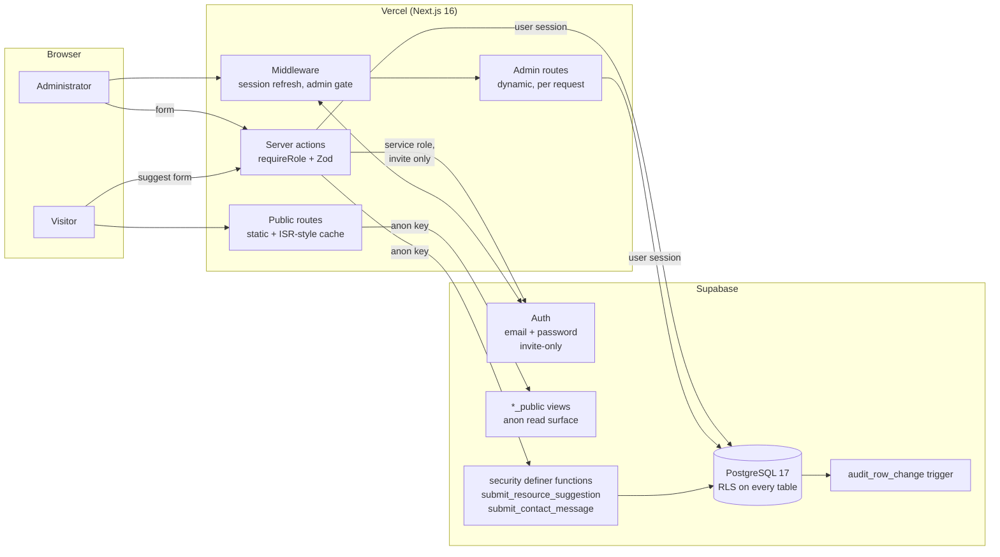
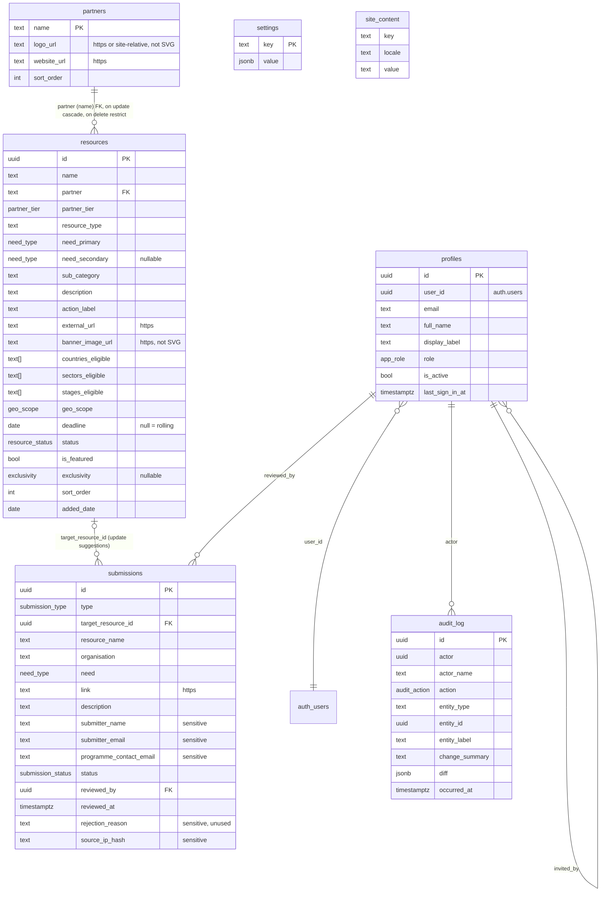

# AskHub — Technical Documentation

| | |
|---|---|
| **Product** | AskHub, the public resource directory of the AI Hub for Sustainable Development |
| **Document** | Technical Documentation |
| **Version** | 1.0 |
| **Date** | 20 September 2026 |
| **Document owner** | Maintaining engineering team (technical lead role) |
| **Status** | Final for circulation |
| **Audience** | Engineers running, deploying, maintaining or extending AskHub |

## Revision history

| Version | Date | Change |
|---|---|---|
| 1.0 | 20 September 2026 | First edition, derived from the repository at this date. |

## Table of contents

1. [System overview and architecture](#1-system-overview-and-architecture)
2. [Technology stack](#2-technology-stack)
3. [Repository structure](#3-repository-structure)
4. [Data model](#4-data-model)
5. [Content lifecycle in the data layer](#5-content-lifecycle-in-the-data-layer)
6. [API and routes](#6-api-and-routes)
7. [Admin authentication and authorisation](#7-admin-authentication-and-authorisation)
8. [Search, filtering and sorting](#8-search-filtering-and-sorting)
9. [Public submission flow](#9-public-submission-flow)
10. [Integrations and third-party services](#10-integrations-and-third-party-services)
11. [Environments and configuration](#11-environments-and-configuration)
12. [Local development setup](#12-local-development-setup)
13. [Build, deployment and rollback](#13-build-deployment-and-rollback)
14. [Security](#14-security)
15. [Performance, caching and SEO](#15-performance-caching-and-seo)
16. [Accessibility implementation](#16-accessibility-implementation)
17. [Testing](#17-testing)
18. [Observability](#18-observability)
19. [Maintenance runbook](#19-maintenance-runbook)
20. [Known limitations and technical debt](#20-known-limitations-and-technical-debt)
21. [Extension guide](#21-extension-guide)
22. [Glossary and assumptions to confirm](#22-glossary-and-assumptions-to-confirm)

---

## 1. System overview and architecture

AskHub is a server-rendered web application with two faces on one codebase: a public, anonymous, statically rendered directory, and an authenticated administration portal. Both talk to one PostgreSQL database hosted on Supabase, which also provides authentication. The application is deployed on Vercel.

The design has one organising idea: **the database is the security boundary.** Every table has row-level security enabled and denies by default. Anonymous visitors can read only through a fixed set of `*_public` views whose columns are registered in a test. Anonymous writes go through exactly two narrowly scoped database functions. Staff writes run under the signed-in user's own database role, and an audit row is written by a database trigger inside the same transaction — the application never writes the audit log itself, and cannot.



Rendering approach: public pages are prerendered at build time and refreshed by tag-based cache invalidation on every admin write, so an edit appears on the public site without a rebuild. Admin pages are rendered per request. Interactive islands (the filtered directory, the browse menu's active state) are client components inside `Suspense` boundaries whose fallback is the real server-rendered content, so the page is complete without JavaScript.

## 2. Technology stack

| Layer | Technology | Version | Notes |
|---|---|---|---|
| Framework | Next.js (App Router) | 16.2.12 (pinned) | Server components, server actions, route groups, `unstable_cache` with tags. |
| UI | React | 19.2.4 (pinned) | `useActionState`, `useTransition` for form pending states. |
| Language | TypeScript | ^5 (5.9 installed) | `strict`, `noUncheckedIndexedAccess`, `verbatimModuleSyntax`. |
| Styling | Tailwind CSS | ^4 (4.3 installed) | Design tokens declared in `src/app/globals.css` under `@theme`; no Tailwind config file. Component styles are mostly inline objects transcribed from the approved prototype. |
| Validation | Zod | ^4.4 | Every server boundary parses input with a Zod schema. |
| Database and auth | Supabase (PostgreSQL 17, GoTrue) | CLI ^2.109; `@supabase/supabase-js` ^2.110; `@supabase/ssr` ^0.12 | Local stack via Docker; hosted projects for staging and production. |
| Spreadsheets | `read-excel-file`, `write-excel-file` | ^9.3, ^4.1 | Tracker import (read) and public Excel export (write), loaded on demand. |
| Tests | Vitest, Testing Library, jsdom | ^4.1, ^16.3, ^30 | Unit, component, database (RLS) and structural suites. |
| Lint | ESLint 9 with `eslint-config-next` | ^9, 16.2.12 | Flat config. |
| Font | Outfit, self-hosted WOFF2 | — | No third-party font CDN (test-enforced). |
| Hosting | Vercel | — | Preview and Production environments. |
| Runtime | Node.js | **not pinned** | See §20. |

Reasons evident from the code: Next.js App Router for static prerendering with per-tag revalidation; Supabase because RLS lets the database enforce the permission model rather than application code; Zod for one validation vocabulary on both client and server; self-hosted fonts and PNG-only assets for privacy and the SVG ban; Tailwind v4 tokens so colour values live in one file that a contrast test can read.

## 3. Repository structure

```
.
├── .env.example                  # every environment variable name, documented
├── CLAUDE.md                     # non-negotiable rules for anyone changing the code
├── README.md                     # commands, versions, test prerequisites, deploy posture
├── next.config.ts                # headers, /about redirect, server-action body limit
├── vitest.config.ts              # loads .env.test; serial files; global fixture sweep
├── docs/
│   ├── AskHub-PRD.md             # product requirements (this set)
│   ├── AskHub-Technical-Documentation.md
│   ├── AskHub-User-Guide.md
│   ├── deployment.md             # first-deployment runbook and launch checklist
│   ├── client-deliverables-request.md
│   ├── sp3-ledger.md             # decision ledger from the admin portal build (historical)
│   ├── archive/                  # superseded internal specification
│   └── superpowers/              # historical build plans and designs
├── public/
│   ├── fonts/                    # Outfit WOFF2
│   ├── logos/                    # AI Hub, MIMIT, UNDP, social icons (PNG)
│   └── partners/                 # AskHub wordmark and provider logo assets (PNG)
├── scripts/
│   ├── seed.ts                   # loads placeholder content; insert-only for providers
│   ├── seed-data.ts              # the placeholder dataset (to be replaced)
│   └── provision-admins.ts       # creates the first admin accounts
├── src/
│   ├── app/
│   │   ├── layout.tsx            # root: font preload, robots noindex
│   │   ├── globals.css           # tokens, prototype globals, responsive rules
│   │   ├── (public)/             # home, resources/[id], contact, privacy, terms, impact
│   │   ├── (admin)/admin/        # dashboard, reach, resources(+import), review, settings, audit, login, forgot-password, set-password
│   │   └── api/health/route.ts   # the only route handler
│   ├── components/
│   │   ├── public/               # 18 presentational and island components
│   │   └── admin/                # portal screens' components, incl. ResourceModal/Form/Table
│   ├── lib/
│   │   ├── actions/              # 'use server' modules: resources, submissions, suggestions, settings, content, users, session
│   │   ├── admin/                # readers, guard, tracker-import, dashboard-view, partners (ensureProvider)
│   │   ├── public/               # readers (cached), filters, search-parse, export, jsonld, geo, cache tags
│   │   ├── schemas/              # Zod: resource, suggestion, settings, content, user
│   │   ├── supabase/             # client factories: browser, server, admin (service role), env; generated types
│   │   ├── auth.ts               # getCurrentUser, requireRole
│   │   ├── deadline.ts           # deadlineInfo, EXPIRING_SOON_DAYS
│   │   ├── i18n.ts               # t(), locale fallback
│   │   └── reference.ts          # COUNTRIES, SECTORS, STAGES, NEED_KEYS, RESOURCE_TYPES
│   ├── locales/                  # en.json (all copy); fr, pt, ar stubs
│   └── proxy.ts                  # middleware: session refresh, /admin gate
├── supabase/
│   ├── config.toml               # local stack: auth policy, ports, redirect URLs
│   ├── migrations/               # 0001 … 0027, forward-only
│   ├── seed.sql                  # test users and test-only introspection helpers
│   └── migrations/README.md      # migration conventions
└── tests/
    ├── unit/  components/  rls/  structure/  helpers/  seed.test.ts  smoke.test.ts
```

## 4. Data model

The schema source of truth is `supabase/migrations/` (applied in order); `src/lib/supabase/database.types.ts` is generated from it (`npm run db:types`) and must be regenerated after any migration.

### 4.1 Entities



Further tables exist with RLS and audit triggers but no application screen yet: `headline_stats`, `compute_metrics`, `programmes`, `impact_stories` (site content with provenance columns — a stat cannot be stored without a source, an attester and a date); `partnerships`; `subscribers`, `digest_sends`, `contact_messages`; `updates_log`; `engagement_events` (the first-party analytics table; no writer exists yet).

### 4.2 Enumerations

| Enum | Values (in order) |
|---|---|
| `need_type` | `compute`, `training`, `funding`, `accelerator`, `data`, `challenges`, `community` — shown as Compute, Courses, Funding, Accelerators, Data & Datasets, Challenges & Competitions, Community & Events |
| `resource_status` | `live`, `pipeline`, `reference` |
| `geo_scope` | `global`, `all_africa`, `partner_countries`, `specific` |
| `partner_tier` | `strategic`, `government`, `development_partner`, `academic`, `network` |
| `exclusivity` | `exclusive`, `early_access` |
| `submission_type` | `new_resource`, `update_suggestion` |
| `submission_status` | `pending`, `approved`, `rejected` |
| `partnership_stage` | `prospecting`, `in_discussion`, `active`, `delivered` |
| `audit_action` | `published`, `edited`, `created`, `deleted`, `approved`, `rejected`, `role_changed`, `digest_sent` |
| `app_role` | `admin`, `editor`, `viewer` |

`NEED_KEYS` in `src/lib/reference.ts` mirrors `need_type` element-for-element; a test fails if they drift. Display labels for every enum live in `src/locales/en.json`.

### 4.3 Public views (the anonymous read surface)

| View | Base | Projects | Filter |
|---|---|---|---|
| `resources_public` | resources ⟕ partners | id, name, partner_name, partner_logo_url, partner_website_url, partner_tier, resource_type, need_primary, need_secondary, sub_category, description (+fr/pt/ar), action_label, external_url, banner_image_url, countries/sectors/stages_eligible, geo_scope, deadline, is_featured, exclusivity, sort_order, added_date, **is_closed**, **days_left** | `status = 'live'`; `status` itself is never projected |
| `need_counts_public` | resources | need, live_count (primary or secondary, once per resource) | live and not past deadline |
| `partners_public` | partners | name, logo_url, website_url, sort_order | none |
| `site_content_public`, `headline_stats_public`, `compute_metrics_public`, `programmes_public`, `impact_stories_public`, `settings_public` | — | public-safe columns; `settings_public` exposes only the two feature flags | — |

The exact column list of every view is registered in `tests/rls/security-allowlist.ts` (`PUBLIC_VIEW_COLUMNS`, 59 columns) and compared against the database by guards G17/G18; adding a column to a view without registering it fails the suite.

### 4.4 Row-level security

Pattern, applied by every migration that creates a table: `enable row level security`; `revoke all from anon, authenticated`; `grant select, insert, update, delete to authenticated`; `grant all to service_role`; then policies. `current_app_role()` (security definer) returns the caller's role from `profiles` when the profile is active, else null.

| Table family | select | insert / update / delete |
|---|---|---|
| resources, partners, partnerships, subscribers | any active staff role | admin, editor |
| submissions | any active staff role | insert/update: admin, editor (no delete policy) |
| site_content, headline_stats, compute_metrics, programmes, impact_stories | any active staff role | admin, editor |
| settings, profiles | any active staff role | admin only |
| audit_log | any active staff role | none for any role; append-only trigger |
| engagement_events, digest_sends, contact_messages, updates_log | any active staff role | as documented per migration; no anon write anywhere |

`anon` holds no grant on any base table. The `viewer` role therefore has no write path at the database, independent of the interface.

### 4.5 Functions and triggers

| Object | Purpose |
|---|---|
| `submit_resource_suggestion(9 text args)` | Security definer, `search_path = ''`; the public suggestion form's only write. Re-checks caps (errcode `22023`), rate-limits (errcode `54000`: 3 per submitter email/60 min, 5 per IP hash/60 min, 60 total/10 min), inserts `type = 'new_resource'`, `status = 'pending'`. Executable by `anon`, `authenticated`; registered in `ANON_EXECUTABLE`. |
| `submit_contact_message(3 text args)` | Same pattern for the contact-messages table; no page calls it today. |
| `audit_row_change()` | Trigger on every write-policied table (`for each row`, after insert/update/delete). Resolves the actor from `auth.uid()`, diffs old/new JSON, redacts listed columns (`submitter_email`, `submitter_name`, `programme_contact_email`, `source_ip_hash` on submissions; subscriber tokens; contact message body), classifies the action (`published` when a resource goes live; `approved`/`rejected` for a submission's status; `role_changed` for a profile's role), and inserts the audit row. A failing insert aborts the mutation. |
| `audit_log_append_only()` | Refuses update and delete on `audit_log`. |
| `handle_new_user()` | On `auth.users` insert, creates a `profiles` row with role `viewer`. |
| `set_updated_at()` | Maintains `updated_at`. |
| `current_app_role()` | See §4.4. |

## 5. Content lifecycle in the data layer

There is no draft, archived or reopening state. The lifecycle is one status column plus one derived date condition.

| Concept | Where | Rule |
|---|---|---|
| Status | `resources.status` | `pipeline` (default on insert), `live`, `reference`. Only `live` rows reach `resources_public`. |
| Open / closed | Derived | `resources_public.is_closed = (deadline is not null and deadline < current_date)`; `days_left = deadline - current_date`. A deadline equal to today is open. Computed in SQL so every surface agrees; the TypeScript `deadlineInfo()` mirrors the rule for the admin table and states `EXPIRING_SOON_DAYS = 14`. |
| Public visibility | Application | `openResources()` drops `is_closed` rows from the home page, directory, rail and export; `need_counts_public` applies the same date condition; the detail page reads the unfiltered list so a closed resource's page still resolves. |
| Reopen | Curator | Edit the deadline. No row state changes; the derived condition changes. |
| Submissions | `submissions.status` | `pending` → `approved` or `rejected`, always with `eq('status','pending')` in the update predicate so two reviewers cannot both approve. Approved suggestions produce a `resources` row; rejected ones are kept. |
| Deletion | `resources` | Hard delete, refused with SQLSTATE `23503` while a submission's `target_resource_id` references the row (`on delete restrict`). |

## 6. API and routes

### 6.1 Public routes

| Route | Rendering | Reads | Purpose |
|---|---|---|---|
| `/` | Static; islands hydrate | `listPublicResources`, `listNeedCounts`, `listHeadlineStats`, `getSiteContent` | Home: welcome band, stats, browse menu, rail, directory |
| `/resources/[id]` | Static per known id; unknown ids resolve on demand (`dynamicParams` default) | `getPublicResource` | Detail page with JSON-LD |
| `/contact` | Static | — | Mailbox and the suggestion modal |
| `/privacy`, `/terms` | Static | `getSiteContent` | Legal copy |
| `/impact` | Static | `isFeatureEnabled`, `listImpactStories` | 404 unless `feature_public_impact_page` is on |
| `/about` | Redirect 308 | — | To the AI Hub website |
| `GET /api/health` | Dynamic | — | `{ "ok": true }` |

### 6.2 Admin routes

All under the `(admin)` group, `force-dynamic`, rendered inside `AdminLayout`, which resolves the user once per request.

| Route | Gate | Purpose |
|---|---|---|
| `/admin/login`, `/admin/forgot-password`, `/admin/set-password` | none (session-optional; listed in `PAGE_ROLE_EXEMPT`) | Sign in; request a reset link; land from an invitation or reset link and set a password |
| `/admin` | admin, editor, viewer | Dashboard |
| `/admin/reach` | admin, editor, viewer | Placeholder stating reporting is not available |
| `/admin/resources` | admin, editor, viewer (write controls only for admin/editor) | Table, filters, modal create/edit, bulk publish, delete |
| `/admin/resources/import` | admin, editor | Tracker import |
| `/admin/review` | admin, editor (`notFound` otherwise) | Review Queue |
| `/admin/settings` | admin, editor (admin-only cards absent for editors) | Four settings cards |
| `/admin/audit` | admin, editor, viewer | Audit log |

`src/proxy.ts` (Next middleware) refreshes the Supabase session cookie on every matched request and redirects a signed-out visitor from any `/admin` path except the three session-optional ones to `/admin/login`, without a `next` parameter. It excludes static assets, fonts, `robots.txt`, `sitemap.xml` and `/api/health`.

### 6.3 Server actions

All in `src/lib/actions/`. Every mutating action opens with `await requireRole([...])` (enforced by `tests/structure/action-role-checks.test.ts`), parses input with Zod, writes on the caller's RLS-bound client, and calls `revalidateTag` or carries a `// no-revalidate:` reason (enforced by `revalidation-contract.test.ts`).

| Module | Action | Roles | Effect |
|---|---|---|---|
| `resources.ts` | `createResource(input)` | admin, editor | `ensureProvider` → `assertKnownPartner` → insert; returns `{ id }` |
| | `updateResource(id, input)` | admin, editor | as above with update |
| | `setResourceStatus(id, status)`, `setResourceFeatured(id, bool)` | admin, editor | single-column updates |
| | `publishResources(ids[])` | admin, editor | one `update … in(ids) … neq(status,'live')`; returns `{ published }` |
| | `deleteResource(id)` | admin, editor | returns `{ ok }` or `{ ok:false, reason:'referenced' }` on 23503 |
| | `importTrackerResources({csv} \| {xlsx})` | admin, editor | parse, validate, batch-create providers, insert row by row; returns a per-row report |
| `submissions.ts` | `approveAndPublishSubmission(id)` | admin, editor | map suggestion → resource, `ensureProvider`, insert live, mark approved |
| | `createResourceFromSubmission(id, input)` | admin, editor | "Edit first" completion |
| | `markSubmissionApproved(id)`, `rejectSubmission(id)` | admin, editor | status updates with the pending predicate |
| `suggestions.ts` | `submitResourceSuggestion(input)` | none (anon; in `ACTION_ROLE_EXEMPT`) | Zod → IP hash → RPC; returns `{ok}` or `{ok:false, reason:'invalid'\|'rateLimited'\|'failed'}` |
| `settings.ts` | `saveSetting({key, value})` | admin | one of five keys; contact email accepts only the pinned mailbox |
| `content.ts` | `saveContentEntry`, and create/save/delete for stats, compute metrics, programmes, impact stories | admin, editor | site content tables (only the welcome band has a screen today) |
| `users.ts` | `inviteUser`, `changeUserRole`, `setUserActive` | admin | `inviteUser` is the sole service-role caller (Auth Admin API); self-demotion and self-deactivation refused |
| `session.ts` | `signIn`, `signOut`, `requestPasswordReset` | none | one failure message for every sign-in failure; reset always reports "done" |

Return-not-throw is used for every refusal a person can act on, because Next.js replaces a thrown action error's message with a digest in production.

## 7. Admin authentication and authorisation

- **Identity**: Supabase Auth, email and password. Self-registration is disabled at the project level (`enable_signup = false`) and asserted at runtime by a test. Password policy: at least 12 characters with lower, upper, digit and symbol.
- **Accounts**: created only by `scripts/provision-admins.ts` (first administrators) or by `inviteUser` from the Team access card. `handle_new_user()` creates every profile as `viewer`; an admin then assigns the role. Deactivation sets `is_active = false`, after which `current_app_role()` returns null and every policy stops passing.
- **Session**: `@supabase/ssr` stores the session in cookies; middleware refreshes it. `getCurrentUser()` (memoised per request) validates the token with the auth server and reads the profile; `requireRole(allowed)` throws `UNAUTHENTICATED` or `FORBIDDEN`; `requirePageRole` turns that into `notFound()` for pages.
- **Clients**: `createServerSupabase()` (anon key + caller's cookies — RLS as the user), `createBrowserSupabase()` (same, in the browser; used only to adopt an invitation or reset link's tokens and set a password), `createPublicSupabase()` (anon key, no cookies — the public readers and the suggestion RPC), `createAdminSupabase()` (service role; one caller). `service-role-containment.test.ts` pins that caller list.
- **Invitation and reset links** land on `/admin/set-password` with the session in the URL fragment; the page reads the fragment itself, stores the session, and clears the fragment from the address bar. Redirect targets must be on the Supabase project's allow-list.
- **Interface gating** mirrors the roles (`visibleNavItems`, `canWrite`, `canAdminister`) and is tested to never render a write control disabled by role — controls are absent for a viewer.

## 8. Search, filtering and sorting

All in `src/lib/public/`, pure functions over the cached list of live resources, executed in the browser after hydration and on the server for the no-JavaScript fallback.

| Step | Function | Behaviour |
|---|---|---|
| URL → criteria | `parseFilters(params)` | Reads `need`, `sector`, `country`, `stage`, `q`, `sort`, `page`; unknown values fall back to defaults; `page` accepts digits only |
| Plain language | `parseQuery(q)` | Tokenises; maps synonyms to a need (`grants` → funding, `courses` → training…), a sector, a stage, a country alias; strips stop words; the leftover words become the text query |
| Filter | `filterResources(rows, criteria)` | Need matches primary or secondary; sector/stage lists match when empty ("open to all") or containing the value; country matches unless scope is `specific` and the list excludes it; every leftover word must appear in name, provider, description or sub-category |
| Sort | `sortResources(rows, mode)` | `featured`: featured first, then `sort_order`, then id; `recent`: `added_date` desc, then id — ties broken deterministically to avoid hydration mismatch |
| Page | `paginate(rows, page, 12)` | Clamps to an existing page |
| Criteria → URL | `toSearchParams`, `directoryHref`, `browseHref` | Omits defaults; page resets on any filter change (`resetPageOnFilterChange`) |
| Export | `toCsv`, `toXlsx` over `EXPORT_COLUMNS` | 14 public columns; Excel writer imported on click |

## 9. Public submission flow

1. `SuggestResourceModal` (client) validates with `suggestionInput` (`src/lib/schemas/suggestion.ts`): names ≤ 200, description ≤ 1,500, `https://` link ≤ 2,048, category in `NEED_KEYS`, sectors/countries from the reference lists, `openToAll`, optional `deadline` (`YYYY-MM-DD`), optional contact email, submitter name ≤ 120, submitter email, and a honeypot `website` that must be empty. Emails are lower-cased.
2. `composeSuggestionDescription` appends one line — countries · sectors · deadline — to the description (never any personal field; a test asserts the output contains no `@`).
3. `submitResourceSuggestion` (server action, no role check) re-parses, computes `sha256(ip + SUBMISSION_IP_PEPPER)` from `x-forwarded-for` when the pepper is set, and calls the RPC on the sessionless anon client.
4. `submit_resource_suggestion` re-checks every cap, applies the three rate limits, and inserts. Errors map to `invalid` (22023) or `rateLimited` (54000).
5. The row appears in the Review Queue. Personal fields are redacted in the audit log.

## 10. Integrations and third-party services

| Service | Used for | Configuration |
|---|---|---|
| Supabase (hosted) | PostgreSQL, Auth, the invitation and password-reset emails (via Supabase's built-in mailer) | Project URL and anon key (public); service-role key (server-only) |
| Vercel | Hosting, edge network, Preview/Production environments, Deployment Protection | Environment variables set in the project |
| Google Analytics 4 | Planned product analytics | A Measurement ID setting exists; **no tag is loaded and no event is sent** in this release |
| Transactional email provider | Alerts, digests, contact form | **None chosen**; nothing in the code sends mail |
| Error monitoring | — | **None** |
| Captcha | — | **None** (rate limiting in the database only) |

## 11. Environments and configuration

| Environment | Database | App | Notes |
|---|---|---|---|
| Local | Supabase CLI stack in Docker (`127.0.0.1:54321`; Studio 54323; mail catcher 54324) | `next dev` on 3000 | `.env.local` |
| Test | Same local stack | Vitest | `.env.test`; every test client refuses a non-loopback target |
| Vercel Preview | Hosted staging project | Per-branch deployment | Deployment Protection on; `noindex` |
| Vercel Production | Hosted production project (to be provisioned by the client) | — | Auth settings do not carry over from `config.toml` and must be applied in the dashboard |

Environment variables (names and purpose only):

| Name | Scope | Purpose |
|---|---|---|
| `NEXT_PUBLIC_SUPABASE_URL` | public | Supabase project URL |
| `NEXT_PUBLIC_SUPABASE_ANON_KEY` | public | Anonymous key; grants only what RLS allows |
| `NEXT_PUBLIC_SITE_URL` | public | Absolute origin for canonical URLs and share links |
| `SUPABASE_SERVICE_ROLE_KEY` | secret, server | Used by the invitation action and operator scripts only |
| `SUBMISSION_IP_PEPPER` | secret, server, optional | Keys the IP hash used by the suggestion rate limit |
| `SUPABASE_URL`, `SUPABASE_ANON_KEY` | test only | Read by test helpers from `.env.test` |
| `SEED_ENV_FILE`, `SEED_CONFIRM_REMOTE` | operator scripts | Choose the env file; permit a non-loopback target (`=1`) |

`tests/structure/env-contract.test.ts` requires the first seven to be documented in `.env.example` and forbids any `NEXT_PUBLIC_` name containing a secret.

## 12. Local development setup

Prerequisites: Node.js (version not pinned; a current LTS is used), Docker Desktop, the repository.

1. `npm install`
2. `npm run db:start` — starts the local Supabase stack.
3. `npx supabase status` — copy the API URL, anon key and service-role key into `.env.local` and `.env.test`, using the names in `.env.example` (both files need every name).
4. `npm run db:reset` — applies all 27 migrations and `seed.sql` (test users and test-only helpers).
5. `npm run db:types` — regenerates `src/lib/supabase/database.types.ts` (commit it with any migration).
6. `npm run seed` — loads the placeholder providers, resources and site copy.
7. `npm run provision:admins` followed by the administrator's email address — creates the account; you type the password interactively, and it is never printed or logged.
8. `npm run dev` — <http://localhost:3000> for the public site, `/admin/login` for the portal.
9. `npm run build && npm test` — the routes test reads the build manifest, so build first.

Seed and provisioning scripts refuse any database that is not on a loopback address unless `SEED_CONFIRM_REMOTE=1`.

## 13. Build, deployment and rollback

- **Build**: `npm run build`. No continuous-integration pipeline exists in the repository; lint, typecheck, build and tests are run locally before pushing.
- **Deploy**: Vercel builds every push; Production tracks the configured branch. `docs/deployment.md` is the runbook, including the launch checklist and the three `noindex` mechanisms that must be removed together at public launch.
- **Database migrations**: `npx supabase db push` applies pending migrations to the linked hosted project. Migrations are forward-only; there is no down migration. Apply them before deploying application code that depends on them.
- **Rollback**: Vercel's instant rollback restores the previous application build. A schema change cannot be rolled back automatically — write a new forward migration. Enum values cannot be removed in place; the repository's precedent (migrations 0013 and 0026) is to recreate the type.
- **Cache**: no cache purge is needed on deploy; a new build starts with an empty cache, and admin writes invalidate by tag.

## 14. Security

| Concern | Implementation |
|---|---|
| Input handling | Zod at every server action; database functions re-check caps for callers holding the anon key; `https://` enforced by CHECK constraints; SVG rejected by constraint and schema |
| Authorisation | `requireRole` first statement (structurally tested); RLS deny-by-default; anon has no base-table grants; two anon-executable functions, registered and counted |
| Secrets | Service-role key server-only, one caller, absent from client bundles (verified in the deploy checklist); the IP pepper never leaves the server |
| Headers | `X-Robots-Tag: noindex, nofollow` (preview posture), `X-Content-Type-Options: nosniff`, `Referrer-Policy: strict-origin-when-cross-origin`. **Not yet set**: Content-Security-Policy, Strict-Transport-Security, Permissions-Policy, frame-ancestors |
| Audit | Trigger-written, same transaction, actor from `auth.uid()`, sensitive columns redacted, append-only |
| Rate limiting | In the suggestion function; Supabase Auth's own limits for sign-in and email |
| Dependency policy | Framework and React pinned exactly; other dependencies caret-ranged; no automated update or vulnerability scanning in the repository |
| Admin access | Invite-only; 12-character policy; no MFA (not enabled in `config.toml`) |

## 15. Performance, caching and SEO

- Public readers use `unstable_cache` with tags (`resources`, `partners`, `site-content`, `headline-stats`, `impact-stories`, `settings`). Resources and counts expire after 900 s (bounding the staleness of the SQL-derived `is_closed` after midnight); settings after 300 s. Every admin write calls `revalidateTag(tag, { expire: 0 })`.
- `/` never reads `searchParams`, so it prerenders; `useSearchParams` is confined to two `Suspense` islands whose fallbacks are the real content.
- Fonts are self-hosted and preloaded; local images use `next/image`; provider banner images use a plain `` because their hosts are arbitrary.
- The Excel writer is dynamically imported on click.
- SEO: per-page `title`/`description`; JSON-LD `Offer` on detail pages; the site is deliberately `noindex` until launch; no sitemap, `robots.txt` or OpenGraph metadata yet (§20).

## 16. Accessibility implementation

Skip link to `#main`; every form control labelled; `aria-live` regions for save and submission outcomes; `aria-pressed` chips; `aria-expanded` on the phone-width admin menu; native `<dialog>` for every modal (Escape closes, focus contained); `prefers-reduced-motion` disables the card entrance animation. `tests/unit/tokens.test.ts` computes WCAG relative luminance from `globals.css` and holds every category colour at ≥ 4.5:1 against its badge background and against white; two prototype colours were darkened to pass. No automated axe run exists and `globals.css` defines no custom `:focus-visible` style (browser defaults apply).

## 17. Testing

Run: `npm run build && npm test` with the local stack up. Vitest runs files serially (the RLS suites share one database) and sweeps fixture rows before and after the run.

| Folder | Files | What it covers |
|---|---|---|
| `tests/unit/` | 34 | Pure logic: filters, search parsing, deadline rules, schemas, mappers, tokens, i18n content rules, JSON-LD |
| `tests/components/` | 16 | jsdom renders of forms, modals, tables, cards with actions mocked |
| `tests/rls/` | 26 | Real database: per-role policies, anon read scope and view columns, anon-executable functions, audit trigger behaviour, the suggestion RPC as anon, resource actions as editor and viewer, enum parity, fixture hygiene |
| `tests/structure/` | 13 | Source-level guards: `requireRole` first, no disabled-by-role controls, every page gated, `.env.example` contract, every `t()` key exists, no hardcoded copy, migration conventions, partner-FK wiring, revalidation contract, route groups not leaking, service-role containment, tests never target a remote database |
| root | 2 | seed script behaviour; smoke |

Last recorded full run: 91 files, 874 tests, all passing. **Coverage gaps**: no end-to-end browser test in the suite (browser walks were done manually); no accessibility scan; email flows tested only against the local mail catcher by hand; no load test.

## 18. Observability

- Health: `GET /api/health` → `{ "ok": true }` (no version, no dependency check).
- Logging: one `console.error` in the codebase (password-reset failures, without the address). Everything else returns typed outcomes to the interface.
- Error boundaries: `(public)/error.tsx` and `(admin)/admin/error.tsx`; `(admin)/admin/loading.tsx`. No custom `not-found.tsx` — 404s render the framework default.
- Monitoring, tracing, alerting: none. Vercel and Supabase dashboards are the only sources.
- The audit log is the operational record of every change in the portal (`/admin/audit`, filterable, 50 per page).

## 19. Maintenance runbook

| Task | Procedure |
|---|---|
| Dependency updates | `npm outdated`; update in a branch; `npm run lint && npx tsc --noEmit && npm run build && npm test`. Next.js and React are pinned exactly and are updated together. |
| Schema change | New numbered migration; `npm run db:reset && npm run db:types`; update `security-allowlist.ts` if a public view's columns change; `db push` to the hosted project before deploying. |
| Backups | Supabase provides daily backups; point-in-time recovery depends on the plan (§22, T2). Test a restore before launch. |
| Content export | Public CSV/Excel from the directory (14 columns); full export with `pg_dump` against the hosted database. |
| Re-seeding | `npm run seed` is safe to re-run: providers insert-only; resource curation columns (`status`, `is_featured`, `deadline`, `exclusivity`) never overwritten. |
| Rotate the service-role key | Rotate in Supabase; update Vercel; redeploy. Only the invitation action uses it. |
| Add an administrator | Invite from Settings → Team access, or `npm run provision:admins` against the hosted project with `SEED_CONFIRM_REMOTE=1`. |
| Common failure modes | *Routes test fails after any `src/app` change* → `npm run build`. *`db push` fails on an enum* → values were already present; the repository's migrations now use `add value if not exists`. *Invitation or reset link says "no longer valid"* → the landing URL is not on the Supabase redirect allow-list, or the link was already used. *Review Queue shows "something went wrong"* → a migration is pending on the hosted database. *Provider cannot be deleted* → a resource still references it. *Resource cannot be deleted* → a suggestion still references it. |

## 20. Known limitations and technical debt

1. No continuous-integration pipeline; quality gates run locally.
2. Node.js version unpinned.
3. Analytics specified but not wired: no GA4 tag, no `engagement_events` writer, no reach reporting.
4. No email provider; alerts, digests and the contact form's storage path are unused.
5. Security headers incomplete (no CSP, HSTS, Permissions-Policy); no captcha on the public form.
6. No sitemap, `robots.txt`, OpenGraph metadata or branded not-found page.
7. No error monitoring or structured logging.
8. Accessibility verified automatically for contrast only.
9. Seed dataset is placeholder content; five seeded resources name countries outside the 18-country list and cannot be re-saved from the form without removing them.
10. Approve-and-publish is two statements, not one transaction; the failure mode (resource created, suggestion still pending) is documented and surfaces as a duplicate on retry.
11. The `updates_log`, `partnerships`, `subscribers`, `digest_sends`, `contact_messages` tables have no screens.
12. The audit log labels provider entries "Partner: …" (the trigger's label prefix predates the rename to "provider"; changing it is a migration).

## 21. Extension guide

| To add… | Change |
|---|---|
| A category | Migration: recreate `need_type` with the new label in the intended position (see 0026 for the pattern; values cannot be inserted mid-enum without recreation) and restate the two views that depend on it. Then `NEED_KEYS` and `BROWSE_ORDER`, `need.<key>` and `need.<key>.def` in `en.json`, `--color-need-<key>` and `-bg` tokens (≥ 4.5:1 — the tokens test will check), `BANNER_GRADIENT`, search synonyms, the tracker `CATEGORY_TO_NEED` map, and the enum/reference parity tests. |
| A resource field | Migration adds the column; regenerate types; `resourceInput` schema; `toRow` and `rowToResourceInput` in `src/lib/schemas/resource.ts`; `RawValues`/`toRaw`/`toPayload` and a control in `ResourceForm`; `toAdminResource` if the table shows it; the public view and `PUBLIC_VIEW_COLUMNS` (plus count) if visitors see it; `EXPORT_COLUMNS` and `column.<name>` copy if exported; the tracker import's `COLUMNS` if imported. |
| A filter | `FilterCriteria`, `parseFilters`, `toSearchParams`, `filterResources` in `filters.ts`; a synonym table in `search-parse.ts`; a control in `FilterControls`; tests in `tests/unit/filters.test.ts`. |
| A public page | A folder under `src/app/(public)/`; copy in `en.json`; a `metadata` export; the routes test if it must exist. |
| An admin page | A folder under `src/app/(admin)/admin/`; `requireRole`/`requirePageRole` (the affordances guard will fail otherwise); a `NAV_ITEMS` entry with roles; `admin.nav.<key>`; the nav and routes tests. |
| A sourcing channel | Today: none needed — every channel enters through the form, the import or the public suggestion. To record it: a nullable enum column on `resources`, a select in the form, a column in the tracker import, and a field in the review mapper. |
| A server action | Export an async function from a `'use server'` module under `src/lib/actions/`; first statement `await requireRole([...])`; Zod parse; caller's client; `revalidateTag` or a `// no-revalidate:` comment. If it writes `resources.partner`, call `ensureProvider` then `assertKnownPartner` (the FK-wiring guard pins the writer list). |
| An anonymous write | A `security definer` function with `search_path = ''`, caps re-checked, `revoke all … from public; grant execute … to anon, authenticated`, registered in `ANON_EXECUTABLE` with the count bumped; a server action in `ACTION_ROLE_EXEMPT` with a reason. |

## 22. Glossary and assumptions to confirm

### Glossary

| Term | Meaning |
|---|---|
| RLS | Row-level security: per-row access policies enforced by PostgreSQL. |
| `anon`, `authenticated`, `service_role` | The three PostgreSQL roles Supabase requests run as: anonymous visitor; signed-in user; the bypass-everything server key. |
| Public view (`*_public`) | A view that projects only public-safe columns for `anon`. |
| Security definer function | A database function that runs with its owner's privileges; used for the two anonymous writes and the audit trigger. |
| Server action | A Next.js function marked `'use server'`, callable from the browser, running on the server. |
| Revalidation tag | A label on cached data; `revalidateTag` evicts everything under it. |
| Provider | The organisation whose opportunity a resource is; table `partners`, FK column `resources.partner`. |
| Tracker import | Bulk creation of resources from the programme team's tracking spreadsheet. |
| Pepper | A server secret mixed into a hash so the hash cannot be reversed by brute force. |

### Assumptions to confirm

| # | Assumption | Basis |
|---|---|---|
| T1 | A current Node.js LTS release is the intended runtime. | No pin in `package.json`, `.nvmrc` or CI. |
| T2 | The hosted Supabase plan includes daily backups; point-in-time recovery is to be confirmed. | Not determinable from the repository. |
| T3 | Vercel and Supabase regions for production will be chosen for EU data residency, as the archived specification required. | Not determinable from the repository. |
| T4 | Production Supabase Auth settings (signup off, password policy, redirect allow-list, leaked-password protection) will be applied manually at handover. | `config.toml` governs the local stack only. |
| T5 | `SEED_ENV_FILE` and `SEED_CONFIRM_REMOTE` are intentionally undocumented in `.env.example` because they are operator-only. | Inferred from the scripts. |
| T6 | GA4 wiring, event capture, CSP/HSTS, captcha and the sitemap are one delivery ("public launch hardening"). | Grouped this way in the deployment runbook and comments. |
| T7 | The five seeded resources naming non-programme countries will be retagged or the country list widened by the programme team. | Data decision, not code. |
| T8 | The audit label prefix "Partner:" is acceptable until a migration renames it. | Changing a trigger argument requires a migration and old rows keep the old label. |
